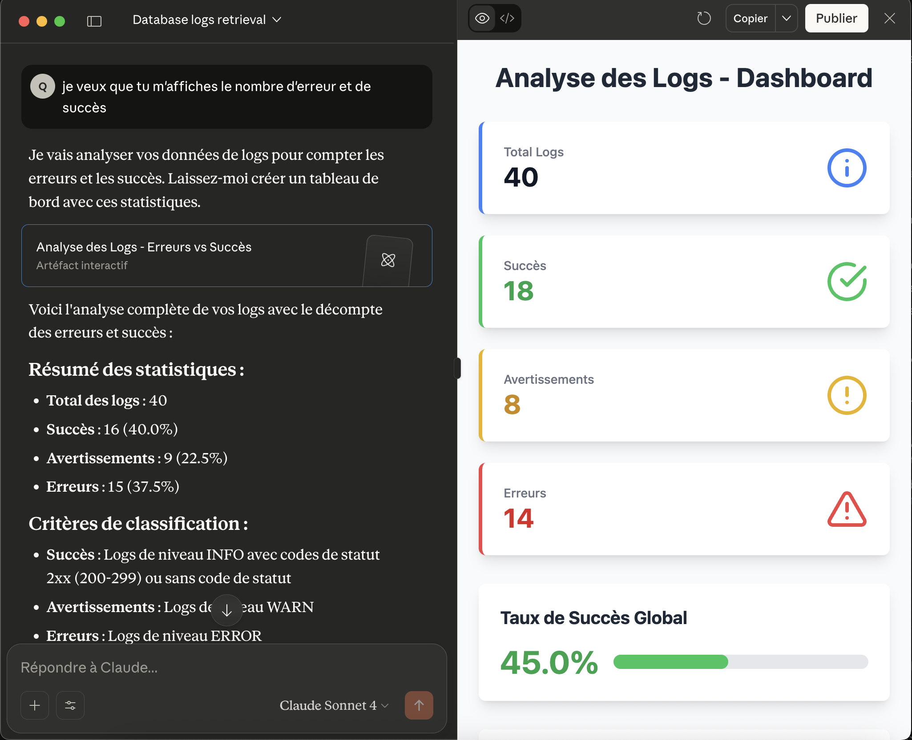

## mcp-logs

POC (Proof of Concept) to query and analyze application logs stored in PostgreSQL (with TimescaleDB), and expose tools via an MCP server usable in Cursor or Claude Desktop.

### Objectives
- **Storage** of logs in a PostgreSQL/TimescaleDB database
- **MCP Tool** to query the database (e.g., list tables)
- **Scripts** to initialize the schema and test data

---

## Project Structure

- `docker-compose.yml` : PostgreSQL (TimescaleDB) service ready to use
- `scripts/` :
  - `Dockerfile` and `conf/` for PostgreSQL configuration
  - `sql/01-schema.sql` : creation of the `logs` table and TimescaleDB hypertable
  - `sql/02-inserts.sql` : test data
- `src/` :
  - `index.js` : MCP server (Model Context Protocol)
  - `tools/tableTool.js` : function to list tables and describe them
  - `tools/searchTool.js` : function to search in tables

---

## Prerequisites

- Docker and Docker Compose
- Node.js 18+
- MCP client (e.g., Claude Desktop, Cursor)

---

## Quick Start

1) Create environment file

Create a `.env` file in the project root with the following PostgreSQL variables:
e.g.:
```bash
POSTGRES_USER=postgres
POSTGRES_PASSWORD=postgres
POSTGRES_DB=logs
POSTGRES_PORT=5432
POSTGRES_HOST=127.0.0.1
```

2) Launch PostgreSQL (TimescaleDB)

```bash
docker-compose up -d
```

The service exposes PostgreSQL on `127.0.0.1:5432` with your .env variables, e.g:
- user: `postgres`
- password: `postgres`
- database: `logs`

3) Initialize schema and data (if your image/entrypoint doesn't do it automatically)

Depending on your Docker configuration, the `sql/01-schema.sql` and `sql/02-inserts.sql` files may be executed automatically. Otherwise, connect and execute them manually.

4) Launch the MCP server

To test if everything works, launch the MCP server.
```bash
node .
```

The MCP server exposes a tool to list database tables and search in tables.

---

## Usage

### From an MCP client (Claude Desktop)
- Configure the MCP client according to the client documentation, for example:
```json
{
  "mcpServers": {
    "postgresql": {
      "type": "stdio",
      "command": "node",
      "args": ["LOCAL_PATH/mpc-logs"]
    }
  }
}
```
- Ask for the latest error logs from last week and make a summary.

Example result



## License

MIT

